# RAG Evaluation Suite

A standalone, multi-layer evaluation system for RAG (Retrieval-Augmented Generation) pipelines. Features LLM-as-a-Judge, classical IR metrics, semantic similarity, hallucination detection, and A/B experiment comparison.

## Features

- **Multi-layer evaluation**: Retrieval metrics, generation quality, semantic similarity, hallucination detection
- **LLM-as-a-Judge**: Pointwise scoring, pairwise comparison, reference-based grading with configurable rubrics
- **Pluggable LLM providers**: Ollama (local, default), OpenAI, Anthropic — switch via config
- **A/B experiments**: Compare RAG configurations with statistical significance tests
- **Rich reporting**: JSON traces, HTML summaries, Streamlit dashboard

## Architecture

```mermaid
graph TB
    subgraph CLI["CLI  (cli.py)"]
        cmd_eval["eval"]
        cmd_exp["experiment"]
        cmd_gen["generate-testset"]
        cmd_cmp["compare"]
        cmd_rpt["report"]
        cmd_dash["dashboard"]
    end

    subgraph Datasets["Datasets  (src/datasets/)"]
        loader["Loader<br/><i>JSON · JSONL · CSV</i>"]
        schema["Schema<br/><i>TestCase · RAGResponse<br/>EvalTestCase · EvalResult</i>"]
        generator["TestSetGenerator<br/><i>LLM-based synthetic Q&A</i>"]
    end

    subgraph Pipeline["Pipeline  (src/pipeline/)"]
        evaluator["Evaluator<br/><i>Orchestrates full eval runs</i>"]
        rag_client["RAGClient<br/><i>Wraps rag_2 pipeline</i>"]
        experiment["ExperimentRunner<br/><i>A/B testing + statistics</i>"]
    end

    subgraph Metrics["Metrics  (src/metrics/)"]
        retrieval["Retrieval<br/><i>Recall · Precision · MRR<br/>NDCG · MAP</i>"]
        generation["Generation<br/><i>Faithfulness · Relevancy<br/>Completeness</i>"]
        hallucination["Hallucination<br/><i>Claim decomposition<br/>Grounding check</i>"]
        semantic["Semantic<br/><i>BERTScore<br/>Cosine similarity</i>"]
        composite["Composite<br/><i>Weighted aggregation</i>"]
    end

    subgraph Judge["LLM Judge  (src/llm_judge/)"]
        judge_base["LLMJudge Base<br/><i>LiteLLM · Jinja2 prompts<br/>JSON parsing · Consensus</i>"]
        pointwise["Pointwise<br/><i>1-5 rubric scoring</i>"]
        pairwise["Pairwise<br/><i>A/B + position debiasing</i>"]
        refbased["Reference-Based<br/><i>Grade vs ground truth</i>"]
    end

    subgraph Reporting["Reporting  (src/reporting/)"]
        reporter["Reporter<br/><i>JSON · HTML</i>"]
        comparator["Comparator<br/><i>Run diff analysis</i>"]
        dashboard["Dashboard<br/><i>Streamlit</i>"]
    end

    subgraph Config["Config  (config/)"]
        eval_cfg["eval_config.yaml"]
        rubrics["rubrics/*.yaml"]
    end

    subgraph External["External Systems"]
        rag2["rag_2 Pipeline<br/><i>Retrieval + Generation</i>"]
        llm_providers["LLM Providers<br/><i>Ollama · OpenAI · Anthropic</i>"]
    end

    %% CLI → Pipeline
    cmd_eval --> evaluator
    cmd_exp --> experiment
    cmd_gen --> generator
    cmd_cmp --> comparator
    cmd_rpt --> reporter
    cmd_dash --> dashboard

    %% Pipeline flows
    evaluator --> loader
    evaluator --> rag_client
    evaluator --> retrieval & generation & hallucination & semantic
    evaluator --> composite
    evaluator --> reporter

    experiment --> loader
    experiment --> rag_client
    experiment --> pairwise

    %% RAG Client → External
    rag_client --> rag2

    %% Metrics → Judge
    generation --> judge_base
    hallucination --> judge_base

    %% Judge hierarchy
    pointwise --> judge_base
    pairwise --> judge_base
    refbased --> judge_base

    %% Judge → LLM
    judge_base --> llm_providers

    %% Generator
    generator --> judge_base

    %% Config
    eval_cfg -.-> evaluator
    eval_cfg -.-> judge_base
    rubrics -.-> judge_base

    %% Styling
    classDef external fill:#f9f0ff,stroke:#7c3aed,stroke-width:2px
    classDef pipeline fill:#eff6ff,stroke:#2563eb,stroke-width:2px
    classDef metrics fill:#f0fdf4,stroke:#16a34a,stroke-width:2px
    classDef judge fill:#fff7ed,stroke:#ea580c,stroke-width:2px
    classDef report fill:#fdf2f8,stroke:#db2777,stroke-width:2px
    classDef config fill:#f5f5f4,stroke:#78716c,stroke-width:1px,stroke-dasharray: 5 5

    class rag2,llm_providers external
    class evaluator,rag_client,experiment pipeline
    class retrieval,generation,hallucination,semantic,composite metrics
    class judge_base,pointwise,pairwise,refbased judge
    class reporter,comparator,dashboard report
    class eval_cfg,rubrics config
```



**Data flow summary:**

1. **CLI** dispatches commands to pipeline orchestrators
2. **Evaluator** loads test sets → queries RAG (pipeline mode) or uses static contexts → scores with all metric layers → produces reports
3. **ExperimentRunner** queries two RAG configs per question → pairwise LLM judge comparison → statistical significance tests (Wilcoxon / bootstrap / paired-t)
4. **Metrics** layer fans out to classical IR, LLM-judged generation quality, claim-level hallucination detection, and embedding-based semantic similarity
5. **LLM Judge** calls are unified through LiteLLM (Ollama/OpenAI/Anthropic) with Jinja2 prompt templates and optional multi-judge consensus
6. **Reporting** produces JSON traces, HTML summaries, run-vs-run diffs, and a Streamlit dashboard

## Quick Start

```bash
# 1. Create venv and install dependencies
python -m venv venv
source venv/Scripts/activate  # Windows (git bash)
# source venv/bin/activate    # Linux/macOS
pip install -r requirements.txt

# 2. Ensure Ollama is running (for local LLM judge)
ollama pull qwen2.5:7b

# 3. Run evaluation on a test set
python cli.py eval --test-set data/test_sets/sample.json

# 4. Run specific metrics
python cli.py eval --test-set data/test_sets/sample.json --metrics retrieval,faithfulness

# 5. A/B experiment
python cli.py experiment --test-set data/test_sets/sample.json \
    --config-a '{"retrieval.hybrid_mode": true}' \
    --config-b '{"retrieval.hybrid_mode": false}'

# 6. Generate synthetic test set
python cli.py generate-testset --docs-path ../rag_2/data/raw/ --num-questions 50

# 7. Compare runs
python cli.py compare --run-a data/results/run_001.json --run-b data/results/run_002.json

# 8. Launch dashboard
python cli.py dashboard
```

## Evaluation Layers

### 1. Retrieval Metrics (`src/metrics/retrieval.py`)
- **Recall@K**, **Precision@K**, **MRR**, **NDCG**, **MAP**
- **Context Relevance** (LLM judge): per-chunk relevance scoring
- **Context Sufficiency** (LLM judge): collective completeness check

### 2. Generation Metrics (`src/metrics/generation.py`)
- **Faithfulness**: claim decomposition → grounding verification
- **Answer Relevancy**: question-answer alignment
- **Completeness**: coverage of ground truth
- **Conciseness**: appropriate brevity

### 3. Hallucination Detection (`src/metrics/hallucination.py`)
- Claim-level decomposition
- Per-claim grounding check against retrieved context
- Hallucination rate calculation

### 4. Semantic Metrics (`src/metrics/semantic.py`)
- Embedding cosine similarity (answer vs ground truth)
- BERTScore (token-level F1)
- Fast, no LLM call needed — ideal for regression checks

### 5. LLM-as-a-Judge (`src/llm_judge/`)

| Mode | Use Case | Method |
|------|----------|--------|
| **Pointwise** | Score a single response (1-5 scale) | Rubric-guided prompt |
| **Pairwise** | A/B comparison | "Which is better and why?" |
| **Reference-based** | Grade vs ground truth | Structured comparison |

### 6. A/B Experiments (`src/pipeline/experiment.py`)
- Multi-config comparison on identical test sets
- Pairwise LLM judge + statistical significance (Wilcoxon / bootstrap)

## Configuration

Edit `config/eval_config.yaml`:

```yaml
judge:
  provider: "ollama"        # "ollama" | "openai" | "anthropic"
  model: "qwen2.5:7b"
  temperature: 0.0

rag:
  project_path: "../rag_2"
  config_path: "../rag_2/config/settings.yaml"
```

Rubrics are defined in `config/rubrics/*.yaml` — human-readable scoring guides.

## Project Structure

```
rag_eval/
├── config/
│   ├── eval_config.yaml       # Main configuration
│   └── rubrics/               # LLM judge rubric definitions
├── src/
│   ├── llm_judge/             # LLM-as-a-Judge core
│   ├── metrics/               # All metric implementations
│   ├── pipeline/              # Evaluation orchestration & RAG client
│   ├── datasets/              # Test set management & generation
│   └── reporting/             # Results, reports, dashboard
├── data/
│   ├── test_sets/             # Test datasets
│   └── results/               # Evaluation outputs
├── tests/                     # Unit tests
├── cli.py                     # Unified CLI
├── requirements.txt
└── README.md
```

## Testing

```bash
python -m pytest tests/ -v
```
